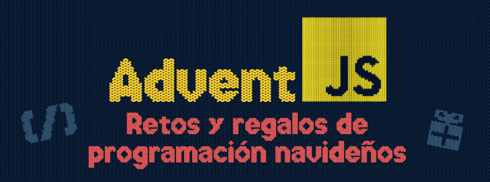

# 🌟 Advent JS - 2023 🌟 



Repositorio donde estoy subiendo los retos realizados de [Advent JS](https://adventjs.dev/)


## 👾 Retos 👾 

<a href="https://adventjs.dev/es/challenges/2023/1">Reto #1: 🎁 ¡Primer regalo repetido! - Fácil</a>

<a href="https://adventjs.dev/es/challenges/2023/2">Reto #2: 🏭 Ponemos en marcha la fábrica - Fácil</a>

<a href="https://adventjs.dev/es/challenges/2023/3">Reto #3: 😏 El elfo travieso - Fácil</a>

## 🔌 Instalación 🔌

Instala las dependencias del projecto:

`npm install`

## 🎭 Tests 🎭
Lanza los test de los retos:

```bash
npm run test # Lanza todos los test
```

Si quieres probar tus propios scripts, tienes dos opciones:

1. Cambiar de nombre el archivo `index.js` y crear tu propio `index.js`
2. Comentar la función en el archivo `index.js` y crear tu propia función

```bash
npm run test # Para correr todos los test de todos los retos

npm run test:n # n siendo el numero del reto, por ejemplo
npm run test:1 # Correra el test del reto 1
```

## About

<div class="flex flex-col items-center"><a id="" class="relative block transition-all transform scale-105 hover:contrast-150" href="/es"><h1 class="flex items-center justify-center text-xl text-yellow-300 font-sweater">Advent</h1></a><div class="flex items-center gap-1 mt-4 mb-10 text-sm">Es una iniciativa de<a class="px-1 bg-white rounded-3xl" href="https://midu.dev" target="_blank" rel="noreferrer"></a></div></div>